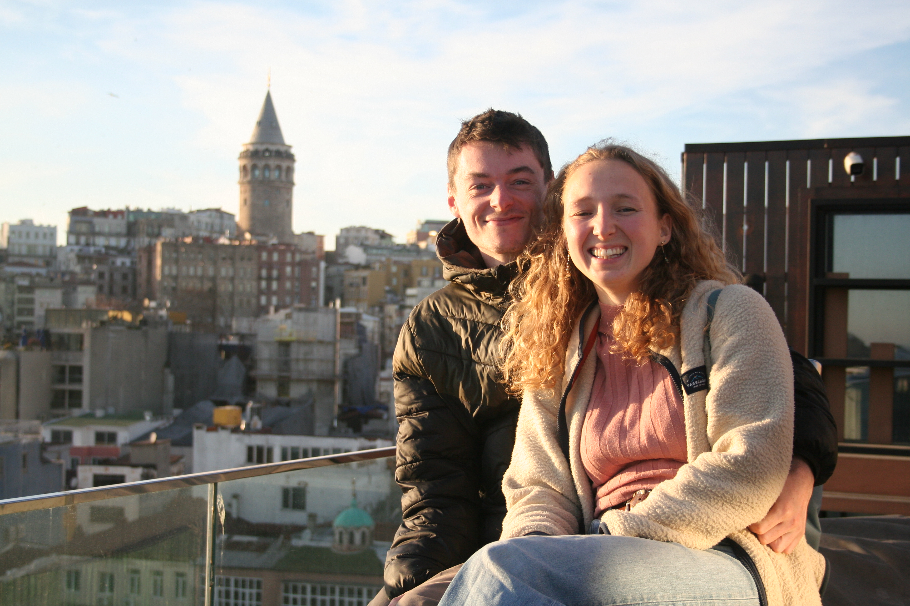
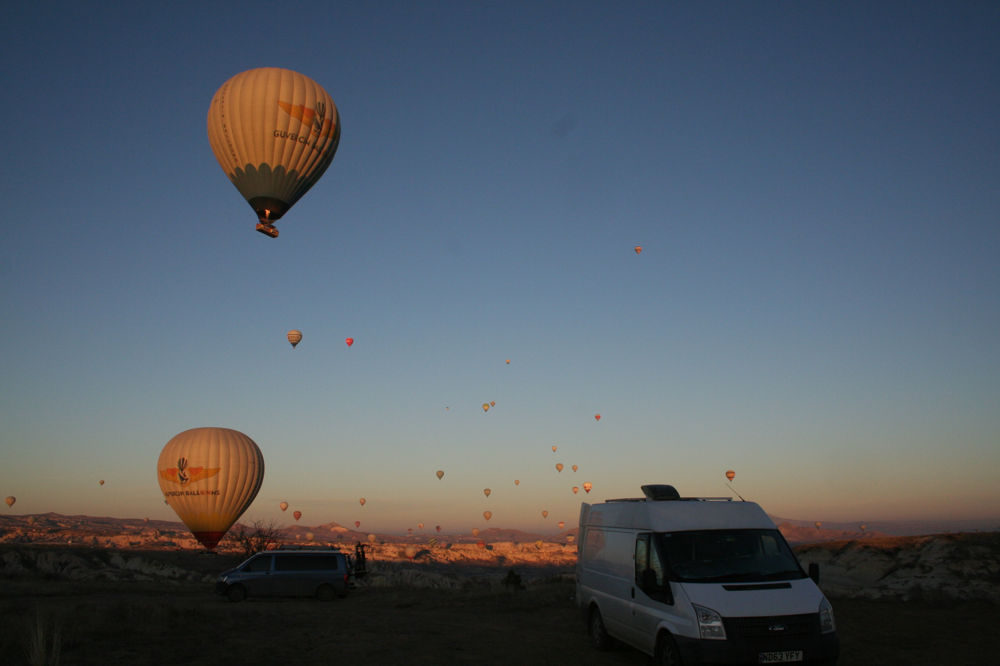

+++
title = "Van Life™"
date = 2023-02-22
+++

I've spent the last 6 months travelling Europe in a self-converted campervan. This is my small contribution to a larger trend known as 'van life'. The typical van-lifer is a mid-30s former white-collar worker looking for a healthy dose of nature, travel and culture. They likely converted the van during the first Covid lockdown period. This archetype is a departure from the original campervan travellers, often a wealthier retired couple exploring the world in an off-the-shelf motorhome camper.

Travelling in a van is a great way to see the world. Especially on a budget, since a traveller's largest expense is usually accommodation. You are able to travel intuitively; slowing down when you stumble upon a place of interest, rather than rushing to complete an itinerary. In fact, many amazing places are only accessible by private transport. Van life can even forcibly integrate you in to your travel destination by requiring work from mechanics and auto electricians.

Unfortunately, life in a van is overtly romanticised on Instagram and TikTok. I'm going to present a few reasons you shouldn't do van-life in descending obviousness

- You have to shit in a bucket. If you are lucky it's a fancy bucket that seals and has a vent for smells. But you still have to empty it.
- It's difficult to make any long-term friends because you are always moving. There are lots of lovely people living the same lifestyle, but eventually, you are going to diverge paths.
- You will spend a bunch of time doing van-life-specific chores that don't need to be done during regular travel or life. Finding water & filling the water tank. Cooking is more complicated with limited fridge and counter space. Showers can be cold and infrequent. Washing the dishes is the worst part of every day. Keeping the van clean is a never-ending battle.

Van life is a trade-off. With it, you offer time, comfort and space in exchange for freedom. For many, that is a trade worth making.

